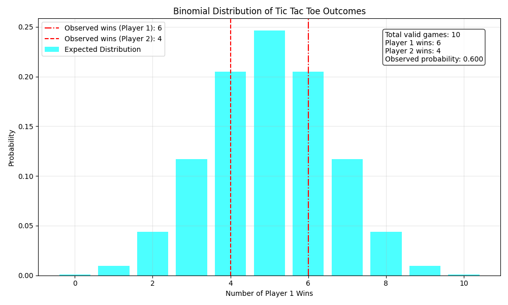

Tic_Tac_Toe

1)Overview

We defined the game-board which can be dynamic in sizes and made the game logic of tic tac toe. Then we tried selecting free APIs that we can use for the implementation. We came up with gemini and groq. we had do do lots of trial and error to come up with the required prompt for the LLMs, we input the same NLP pronpt to both the LLMs. We finally plot the binomial distribution of the trials.

2)Problem we faced(with the API gemini)-

During our initial testing phase we used "gemini-pro" model of gemini which was working fine, ecept token limit was hitting after every few games, so we came up with error handlings that allows the program to wait for 20seconds everythime it hits that error. So, it got resolved. We print out "Resource exhausted error encountered (Groq). Retrying in 20 seconds (attempt 1/3)...". This doesnt indicate that our code has an error. It just makes sure the buffer doesnt get full.

But during our final testing "gemini-pro" model stopped working and we tried using "gemini-1.5-pro" etc for our implementation, but when it was hitting "limited quota" error it was not replenishing. Groq is working fine with error handling. So, when we could not find any other API substitue, we implemented GROQ only under name of gemini.

I am attaching the required gemini code that will work if you replace it with the "def gemini moves" function and enter an API key with high token limit.

    genai.configure(api_key="Add-api-key here")
    def get_gemini_moves(board, last_move, gemini_history,max_attempts=3,delay=20): ####WE are feeding (valid moves) and previous move of opponent LLM as natural language to the LLM
    valid_moves = [(i, j) for i in range(len(board)) for j in range(len(board)) if board[i][j] == " "]
    if last_move is not None:
    first_element = last_move[0]
    second_element = last_move[1]
    last_move_str = f"{first_element},{second_element}"
    else:
    first_element = "N/A,opponent hasnt played a move yet"
    second_element = "N/A,opponent hasnt played a move yet"
    last_move_str = "None"

        history_str = ", ".join([f"({r},{c})" for r, c in gemini_history]) if gemini_history else "None"
        prompt_given_to_gemini = (
            "### Tic-Tac-Toe Game - Your Turn ###\n\n"
            "Current Board State:\n"
            f"{board}\n\n"
            f"Last move played: {last_move}\n\n"
            f"You are playing as 'X'. Your goal is to win the game or block your opponent ('O'). Last move played by opponent LLM is on row number {first_element} and column number {second_element}\n\n"
            f"all the moves played by you is:{gemini_history}, now play the move such that it is included in {valid_moves}, and it makes order such that- 1,1 2,2 .... till n,n or for any number x the order x,1 x,2 till x,n and 1,x 2,x till n,x"
            "### Rules:\n"
            "1. Play inside the dimensions of the board only and win immediately if possible.\n"
            "2. The board is represented as a 2D grid, where each cell is either empty (' '), occupied by an 'X', or occupied by an 'O'.\n"
            "3. The goal is to get your marks in a row, column, or diagonal before your opponent does.\n"
            "4. Respond with a valid move in 'row,column' format (e.g., '1,2').\n"
            "5. DO NOT include explanations, extra text, greetings, or comments in your response.\n"
            "6. You MUST choose an empty spot. If all spots are taken, respond with 'None'.\n"
            "7. If you make an invalid move, your turn will be retried.\n"
            "8. Prioritize winning moves. If no winning move is available, block your opponent.\n\n"
            f"### Allowed Moves: {valid_moves}\n"
            "You can only play one of these valid moves.\n\n"
            "### Valid Example Moves:\n"
            " - '0,2' (if that cell is empty)\n"
            " - '2,1' (if that cell is empty)\n"
            " - 'None' (only if no valid moves remain)\n\n"
            "WARNING: If you respond incorrectly, your turn will be retried.\n\n"
            "Now, enter your move:"
        )

        attempts = 0
        while attempts < max_attempts:
            try:
                model = genai.GenerativeModel("gemini-pro")
                response = model.generate_content(prompt_given_to_gemini)
                move = response.text.strip()
                return move
            except Exception as e:
                error_message = str(e)
                if "Resource has been exhausted" in error_message or "429" in error_message or "InternalServerError" in error_message or "500" in error_message:
                    print(f"Error encountered: {error_message}. Retrying in {delay} seconds (attempt {attempts+1}/{max_attempts})...")
                    time.sleep(delay)
                    attempts += 1
                else:
                    raise
        raise Exception("Max retries reached. Unable to get a move from Gemini.")    ####API limit permanently reached, gotta change API code

I have also commented which part to replace in our main code file. Our main code file is implementing under the name of

LLM prompt we used is-

    prompt_given_to_gemini = (
    "### Tic-Tac-Toe Game - Your Turn ###\n\n"
    "Current Board State:\n"
    f"{board}\n\n"
    f"Last move played: {last_move}\n\n"
    f"You are playing as 'X'. Your goal is to win the game or block your opponent ('O'). Last move played by opponent LLM is on row number {first_element} and column number {second_element}\n\n"
    f"all the moves played by you is:{gemini_history}, now play the move such that it is included in {valid_moves}, and it makes order such that- 1,1 2,2 .... till n,n or for any number x the order x,1 x,2 till x,n and 1,x 2,x till n,x"
    "### Rules:\n"
    "1. Play inside the dimensions of the board only and win immediately if possible.\n"
    "2. The board is represented as a 2D grid, where each cell is either empty (' '), occupied by an 'X', or occupied by an 'O'.\n"
    "3. The goal is to get your marks in a row, column, or diagonal before your opponent does.\n"
    "4. Respond with a valid move in 'row,column' format (e.g., '1,2').\n"
    "5. DO NOT include explanations, extra text, greetings, or comments in your response.\n"
    "6. You MUST choose an empty spot. If all spots are taken, respond with 'None'.\n"
    "7. If you make an invalid move, your turn will be retried.\n"
    "8. Prioritize winning moves. If no winning move is available, block your opponent.\n\n"
    f"### Allowed Moves: {valid_moves}\n"
    "You can only play one of these valid moves.\n\n"
    "### Valid Example Moves:\n"
    " - '0,2' (if that cell is empty)\n"
    " - '2,1' (if that cell is empty)\n"
    " - 'None' (only if no valid moves remain)\n\n"
    "WARNING: If you respond incorrectly, your turn will be retried.\n\n"
    "Now, enter your move:"
    )

3)Sample Run

OUR EXECUTION TERMINAL LOGS- ( We did our final testing with trials=10 due to time constraint, code will work for any number of trials, just replace trials=50 to trials= 'req number of trials' everywhere in the code.
Select game mode:
1 - LLM vs LLM
2 - LLM vs Human
Enter 1 or 2: 1
Enter board size (e.g., 3 for 3x3): 3
Running game 1 of 10...

    |   |
    -----------
    |   |
    -----------
    |   |
    -----------
    Gemini's Turn (X)

    |   |
    -----------
    | X |
    -----------
    |   |
    -----------
    Groq's Turn (O)

    |   |
    -----------
    | X | O
    -----------
    |   |
    -----------
    Gemini's Turn (X)

    X |   |
    -----------
    | X | O
    -----------
    |   |
    -----------
    Groq's Turn (O)

    X | O |
    -----------
    | X | O
    -----------
    |   |
    -----------
    Gemini's Turn (X)

    X | O | X
    -----------
    | X | O
    -----------
    |   |
    -----------
    Groq's Turn (O)

    X | O | X
    -----------
    | X | O
    -----------
    O |   |
    -----------
    Gemini's Turn (X)

    X | O | X
    -----------
    | X | O
    -----------
    O | X |
    -----------
    Groq's Turn (O)

    X | O | X
    -----------
    O | X | O
    -----------
    O | X |
    -----------
    Gemini's Turn (X)

    X | O | X
    -----------
    O | X | O
    -----------
    O | X | X
    -----------
    Gemini (X) wins, letsgooooo!

    Running game 2 of 10...

    |   |
    -----------
    |   |
    -----------
    |   |
    -----------
    Gemini's Turn (X)

    |   |
    -----------
    | X |
    -----------
    |   |
    -----------
    Groq's Turn (O)

    Resource exhausted error encountered (Groq). Retrying in 20 seconds (attempt 1/3)...
    |   |
    -----------
    | X | O
    -----------
    |   |
    -----------
    Gemini's Turn (X)

    X |   |
    -----------
    | X | O
    -----------
    |   |
    -----------
    Groq's Turn (O)

    X | O |
    -----------
    | X | O
    -----------
    |   |
    -----------
    Gemini's Turn (X)

    Resource exhausted error encountered (Groq). Retrying in 20 seconds (attempt 1/3)...
    X | O | X
    -----------
    | X | O
    -----------
    |   |
    -----------
    Groq's Turn (O)

    X | O | X
    -----------
    | X | O
    -----------
    O |   |
    -----------
    Gemini's Turn (X)

    X | O | X
    -----------
    | X | O
    -----------
    O | X |
    -----------
    Groq's Turn (O)

    X | O | X
    -----------
    | X | O
    -----------
    O | X | O
    -----------
    Gemini's Turn (X)

    Resource exhausted error encountered (Groq). Retrying in 20 seconds (attempt 1/3)...
    X | O | X
    -----------
    X | X | O
    -----------
    O | X | O
    -----------
    It's a draw, but groq deserves a win coz it held on even after starting second(fair enough ig)
    Running game 3 of 10...

    |   |
    -----------
    |   |
    -----------
    |   |
    -----------
    Gemini's Turn (X)

    |   |
    -----------
    | X |
    -----------
    |   |
    -----------
    Groq's Turn (O)

    |   |
    -----------
    | X | O
    -----------
    |   |
    -----------
    Gemini's Turn (X)

    Resource exhausted error encountered (Groq). Retrying in 20 seconds (attempt 1/3)...
    X |   |
    -----------
    | X | O
    -----------
    |   |
    -----------
    Groq's Turn (O)

    X | O |
    -----------
    | X | O
    -----------
    |   |
    -----------
    Gemini's Turn (X)

    X | O | X
    -----------
    | X | O
    -----------
    |   |
    -----------
    Groq's Turn (O)

    X | O | X
    -----------
    | X | O
    -----------
    O |   |
    -----------
    Gemini's Turn (X)

    Resource exhausted error encountered (Groq). Retrying in 20 seconds (attempt 1/3)...
    X | O | X
    -----------
    | X | O
    -----------
    O | X |
    -----------
    Groq's Turn (O)

    X | O | X
    -----------
    | X | O
    -----------
    O | X | O
    -----------
    Gemini's Turn (X)

    X | O | X
    -----------
    X | X | O
    -----------
    O | X | O
    -----------
    It's a draw, but groq deserves a win coz it held on even after starting second(fair enough ig)
    Pausing for 20 seconds to avoid overloading errors :)))...

    Running game 4 of 10...

    |   |
    -----------
    |   |
    -----------
    |   |
    -----------
    Gemini's Turn (X)

    |   |
    -----------
    | X |
    -----------
    |   |
    -----------
    Groq's Turn (O)

    |   |
    -----------
    | X | O
    -----------
    |   |
    -----------
    Gemini's Turn (X)

    X |   |
    -----------
    | X | O
    -----------
    |   |
    -----------
    Groq's Turn (O)

    X | O |
    -----------
    | X | O
    -----------
    |   |
    -----------
    Gemini's Turn (X)

    Resource exhausted error encountered (Groq). Retrying in 20 seconds (attempt 1/3)...
    X | O | X
    -----------
    | X | O
    -----------
    |   |
    -----------
    Groq's Turn (O)

    X | O | X
    -----------
    | X | O
    -----------
    | O |
    -----------
    Gemini's Turn (X)

    X | O | X
    -----------
    | X | O
    -----------
    X | O |
    -----------
    Gemini (X) wins, letsgooooo!

    Running game 5 of 10...

    |   |
    -----------
    |   |
    -----------
    |   |
    -----------
    Gemini's Turn (X)

    Resource exhausted error encountered (Groq). Retrying in 20 seconds (attempt 1/3)...
    |   |
    -----------
    | X |
    -----------
    |   |
    -----------
    Groq's Turn (O)

    |   |
    -----------
    O | X |
    -----------
    |   |
    -----------
    Gemini's Turn (X)

    X |   |
    -----------
    O | X |
    -----------
    |   |
    -----------
    Groq's Turn (O)

    X |   | O
    -----------
    O | X |
    -----------
    |   |
    -----------
    Gemini's Turn (X)

    Resource exhausted error encountered (Groq). Retrying in 20 seconds (attempt 1/3)...
    X | X | O
    -----------
    O | X |
    -----------
    |   |
    -----------
    Groq's Turn (O)

    X | X | O
    -----------
    O | X |
    -----------
    | O |
    -----------
    Gemini's Turn (X)

    X | X | O
    -----------
    O | X |
    -----------
    | O | X
    -----------
    Gemini (X) wins, letsgooooo!

    Running game 6 of 10...

    |   |
    -----------
    |   |
    -----------
    |   |
    -----------
    Gemini's Turn (X)

    |   |
    -----------
    | X |
    -----------
    |   |
    -----------
    Groq's Turn (O)

    Resource exhausted error encountered (Groq). Retrying in 20 seconds (attempt 1/3)...
    |   |
    -----------
    | X |
    -----------
    |   | O
    -----------
    Gemini's Turn (X)

    |   |
    -----------
    X | X |
    -----------
    |   | O
    -----------
    Groq's Turn (O)

    |   |
    -----------
    X | X | O
    -----------
    |   | O
    -----------
    Gemini's Turn (X)

    Resource exhausted error encountered (Groq). Retrying in 20 seconds (attempt 1/3)...
    | X |
    -----------
    X | X | O
    -----------
    |   | O
    -----------
    Groq's Turn (O)

    O | X |
    -----------
    X | X | O
    -----------
    |   | O
    -----------
    Gemini's Turn (X)

    O | X | X
    -----------
    X | X | O
    -----------
    |   | O
    -----------
    Groq's Turn (O)

    O | X | X
    -----------
    X | X | O
    -----------
    | O | O
    -----------
    Gemini's Turn (X)

    Resource exhausted error encountered (Groq). Retrying in 20 seconds (attempt 1/3)...
    O | X | X
    -----------
    X | X | O
    -----------
    X | O | O
    -----------
    Gemini (X) wins, letsgooooo!

    Pausing for 20 seconds to avoid overloading errors :)))...

    Running game 7 of 10...

    |   |
    -----------
    |   |
    -----------
    |   |
    -----------
    Gemini's Turn (X)

    |   |
    -----------
    | X |
    -----------
    |   |
    -----------
    Groq's Turn (O)

    |   |
    -----------
    | X | O
    -----------
    |   |
    -----------
    Gemini's Turn (X)

    X |   |
    -----------
    | X | O
    -----------
    |   |
    -----------
    Groq's Turn (O)

    X | O |
    -----------
    | X | O
    -----------
    |   |
    -----------
    Gemini's Turn (X)

    X | O | X
    -----------
    | X | O
    -----------
    |   |
    -----------
    Groq's Turn (O)

    X | O | X
    -----------
    | X | O
    -----------
    O |   |
    -----------
    Gemini's Turn (X)

    Resource exhausted error encountered (Groq). Retrying in 20 seconds (attempt 1/3)...
    X | O | X
    -----------
    | X | O
    -----------
    O | X |
    -----------
    Groq's Turn (O)

    X | O | X
    -----------
    | X | O
    -----------
    O | X | O
    -----------
    Gemini's Turn (X)

    X | O | X
    -----------
    X | X | O
    -----------
    O | X | O
    -----------
    It's a draw, but groq deserves a win coz it held on even after starting second(fair enough ig)
    Running game 8 of 10...

    |   |
    -----------
    |   |
    -----------
    |   |
    -----------
    Gemini's Turn (X)

    Resource exhausted error encountered (Groq). Retrying in 20 seconds (attempt 1/3)...
    |   |
    -----------
    | X |
    -----------
    |   |
    -----------
    Groq's Turn (O)

    |   |
    -----------
    | X | O
    -----------
    |   |
    -----------
    Gemini's Turn (X)

    X |   |
    -----------
    | X | O
    -----------
    |   |
    -----------
    Groq's Turn (O)

    X | O |
    -----------
    | X | O
    -----------
    |   |
    -----------
    Gemini's Turn (X)

    Resource exhausted error encountered (Groq). Retrying in 20 seconds (attempt 1/3)...
    X | O | X
    -----------
    | X | O
    -----------
    |   |
    -----------
    Groq's Turn (O)

    X | O | X
    -----------
    | X | O
    -----------
    O |   |
    -----------
    Gemini's Turn (X)

    X | O | X
    -----------
    | X | O
    -----------
    O | X |
    -----------
    Groq's Turn (O)

    X | O | X
    -----------
    | X | O
    -----------
    O | X | O
    -----------
    Gemini's Turn (X)

    Resource exhausted error encountered (Groq). Retrying in 20 seconds (attempt 1/3)...
    X | O | X
    -----------
    X | X | O
    -----------
    O | X | O
    -----------
    It's a draw, but groq deserves a win coz it held on even after starting second(fair enough ig)
    Running game 9 of 10...

    |   |
    -----------
    |   |
    -----------
    |   |
    -----------
    Gemini's Turn (X)

    |   |
    -----------
    | X |
    -----------
    |   |
    -----------
    Groq's Turn (O)

    |   |
    -----------
    | X | O
    -----------
    |   |
    -----------
    Gemini's Turn (X)

    Resource exhausted error encountered (Groq). Retrying in 20 seconds (attempt 1/3)...
    X |   |
    -----------
    | X | O
    -----------
    |   |
    -----------
    Groq's Turn (O)

    X | O |
    -----------
    | X | O
    -----------
    |   |
    -----------
    Gemini's Turn (X)

    X | O | X
    -----------
    | X | O
    -----------
    |   |
    -----------
    Groq's Turn (O)

    X | O | X
    -----------
    | X | O
    -----------
    O |   |
    -----------
    Gemini's Turn (X)

    Resource exhausted error encountered (Groq). Retrying in 20 seconds (attempt 1/3)...
    X | O | X
    -----------
    | X | O
    -----------
    O | X |
    -----------
    Groq's Turn (O)

    X | O | X
    -----------
    | X | O
    -----------
    O | X | O
    -----------
    Gemini's Turn (X)

    X | O | X
    -----------
    X | X | O
    -----------
    O | X | O
    -----------
    It's a draw, but groq deserves a win coz it held on even after starting second(fair enough ig)
    Pausing for 20 seconds to avoid overloading errors :)))...

    Running game 10 of 10...

    |   |
    -----------
    |   |
    -----------
    |   |
    -----------
    Gemini's Turn (X)

    |   |
    -----------
    | X |
    -----------
    |   |
    -----------
    Groq's Turn (O)

    |   |
    -----------
    | X | O
    -----------
    |   |
    -----------
    Gemini's Turn (X)

    X |   |
    -----------
    | X | O
    -----------
    |   |
    -----------
    Groq's Turn (O)

    X |   | O
    -----------
    | X | O
    -----------
    |   |
    -----------
    Gemini's Turn (X)

    Resource exhausted error encountered (Groq). Retrying in 20 seconds (attempt 1/3)...
    X | X | O
    -----------
    | X | O
    -----------
    |   |
    -----------
    Groq's Turn (O)

    X | X | O
    -----------
    | X | O
    -----------
    | O |
    -----------
    Gemini's Turn (X)

    X | X | O
    -----------
    | X | O
    -----------
    X | O |
    -----------
    Groq's Turn (O)

    X | X | O
    -----------
    | X | O
    -----------
    X | O | O
    -----------
    Groq (O) wins, letsgooooo!

Below is a sample resulting binomial distribution for n=10 trials:

