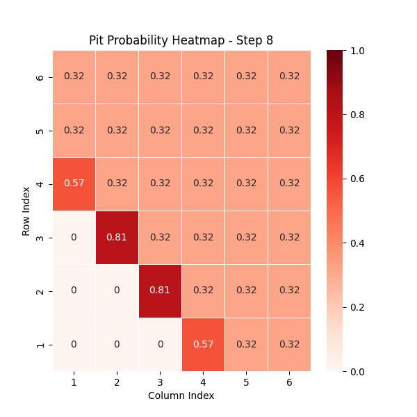

Wumpus World

1)Overview

Wumpus World is a grid-based environment where an agent navigates through a dangerous cave filled with pits, a Wumpus (a monster), and hidden gold. The goal is to find the gold.

We have 2 implementation: random move as well as best move strategy.

    (a) Best move - this implementation integrates Bayesian networks for probabilistic inference, allowing the agent to make intelligent decisions based on perceived environmental cues like breezes (indicating nearby pits). At each move, the probability heat map is generated and saved in the same folder as where you are running the file.

    (b) Random move - this implementation randomly chooses a move from the possible moves allowed. Moreover, upon encountering a pit, the agent moves back to its previous position and continues. Similarly, upon encountering a wumpus, the agent respawns back at (1,1). We have given 50 lives to the agent. At each move, the probability heat map is generated and saved in the same folder as where you are running the file.

A sample heat map of the probabilities is shown below:

2)How It Works

This is how the Best Move code works. The agent starts at position (1,1) in the grid. An example grid picture is attached as follows:

Cell (2,1) refers to the cell above (1,1) while cell (1,2) refers to the cell to the right of (1,1). Agent perceives the environment (Breeze, Stench, Gold, etc.). It updates its knowledge and makes a move. Every move, performance reduces by 1 point. The process repeats until:

    (a) The agent finds gold and exits (+1000 points).
    (b) The agent falls into a pit (-1000 points).
    (c) The agent is eaten by the Wumpus (-1000 points).

3)Running the Code

To run the best move strategy, type the following command:

    python3 wumpus_final.py

To run the random move strategy, type the following command:

    python3 wumpus_random.py
